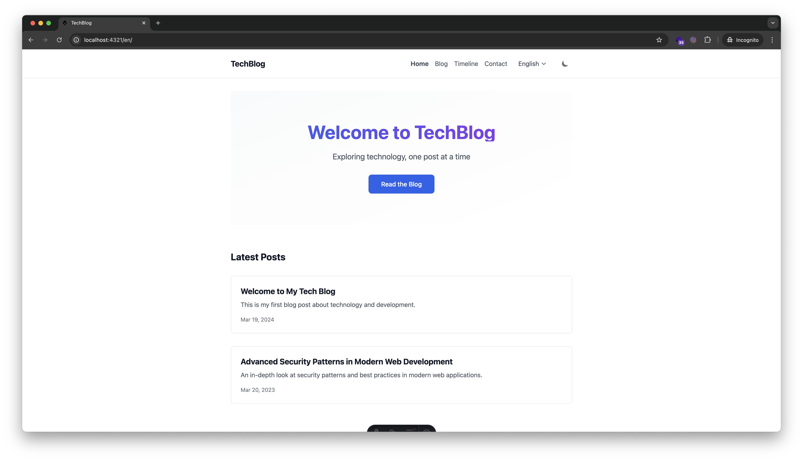
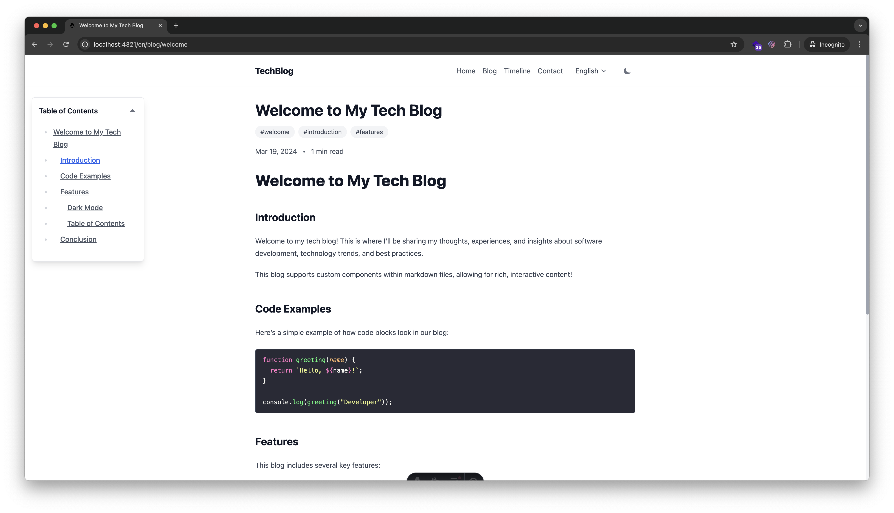

# Multilingual Tech Blog with Astro





A modern, multilingual tech blog built with Astro, featuring dark mode, protected content, and i18n support. This project extends the Astro Basics template with advanced features.

🔗 [Live Demo](https://build-blog-astro.vercel.app/)
[](https://stackblitz.com/github/)
[](https://codesandbox.io/p/sandbox/github/)
[](https://codespaces.new/)

## ✨ Features

- 🌍 **Multilingual Support**
  - English, Spanish, Chinese out of the box
  - Easy to add new languages
  - Language-specific content routing
- 🌓 **Advanced Dark Mode**
  - System preference detection
  - Flicker-free theme switching
  - Persistent preferences
- 🔒 **Content Protection**
  - Password-protected articles
  - Secure cookie-based auth
  - Custom protection levels
- 📱 **Modern UI/UX**
  - Responsive design
  - Interactive components
  - Smooth transitions
- 📖 **Blog Features**
  - Tag-based organization
  - Dynamic TOC
  - Reading time estimation
  - Timeline view

## 🚀 Project Structure

```text
/
├── public/
│   └── favicon.svg
├── src/
│   ├── components/
│   │   ├── Card.astro
│   │   ├── Callout.astro
│   │   ├── Header.astro
│   │   ├── Hero.astro
│   │   ├── LanguagePicker.astro
│   │   ├── PasswordProtection.astro
│   │   ├── PostCard.astro
│   │   ├── SocialLinks.astro
│   │   ├── TagList.astro
│   │   ├── TableOfContents.astro
│   │   └── YearFilter.astro
│   ├── content/
│   │   └── blog/
│   │       ├── en/
│   │       ├── es/
│   │       └── zh/
│   ├── i18n/
│   │   ├── ui.ts
│   │   └── utils.ts
│   ├── layouts/
│   │   ├── BlogPost.astro
│   │   └── Layout.astro
│   └── pages/
│       └── [lang]/
│           ├── blog/
│           ├── contact.astro
│           └── ...
└── package.json
```

## 🧞 Commands

All commands are run from the root of the project, from a terminal:

| Command                    | Action                                           |
| :------------------------- | :----------------------------------------------- |
| `pnpm install`             | Installs dependencies                            |
| `pnpm run dev`             | Starts local dev server at `localhost:4321`      |
| `pnpm run build`           | Build your production site to `./dist/`          |
| `pnpm run preview`         | Preview your build locally, before deploying     |
| `pnpm run astro ...`       | Run CLI commands like `astro add`, `astro check` |
| `pnpm run astro -- --help` | Get help using the Astro CLI                     |
| `pnpm run debug`           | Check content files and their frontmatter        |

## 🛠️ Quick Start

1. **Clone and Install**

```bash
git clone https://github.com/IlIIIIIIlI/build-blog-astro.git
cd build-blog-astro
pnpm install
```

2. **Development**

```bash
pnpm run dev
```

3. **Adding Content**

```markdown
---
title: "My New Post"
description: "Post description"
pubDate: 2024-03-19
tags: ["tech", "tutorial"]
protected: false # Optional: set to true for password protection
password: "secret" # Required if protected is true
---

Your content here...
```

4. **Adding a New Language**

Add to `src/i18n/ui.ts`:

```typescript
export const languages = {
  en: "English",
  es: "Español",
  zh: "中文",
  // Add your language here
};
```

## 🔧 Configuration

### Environment Variables

```env
PUBLIC_SITE_URL=https://yourblog.com
PUBLIC_SITE_TITLE=Tech Blog
```

### Blog Post Protection

```yaml
---
protected: true
password: your-password
---
```

## 👀 Learning Resources

- [Astro Documentation](https://docs.astro.build)
- [Tailwind CSS Documentation](https://tailwindcss.com/docs)
- [Content Collections Guide](https://docs.astro.build/en/guides/content-collections/)

## 🤝 Contributing

1. Fork the repository
2. Create your feature branch (`git checkout -b feature/AmazingFeature`)
3. Commit your changes (`pnpm commit`)
4. Push to the branch (`git push origin feature/AmazingFeature`)
5. Open a Pull Request

## 📝 License

This project is licensed under the MIT License - see the [LICENSE](LICENSE) file for details.

## 🙏 Acknowledgments

- Built with [Astro](https://astro.build)
- Styled with [Tailwind CSS](https://tailwindcss.com)
- Multilingual setup inspired by Astro's i18n routing guide

---

Made with ❤️ and [Astro](https://astro.build)
